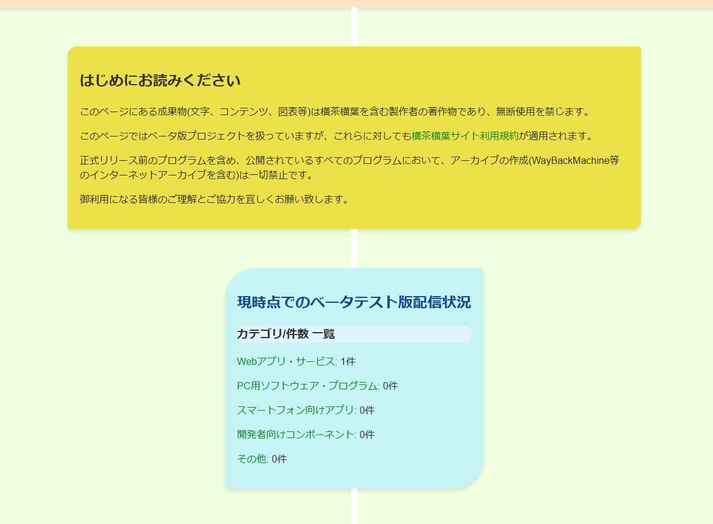
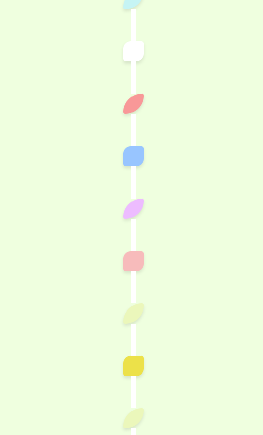
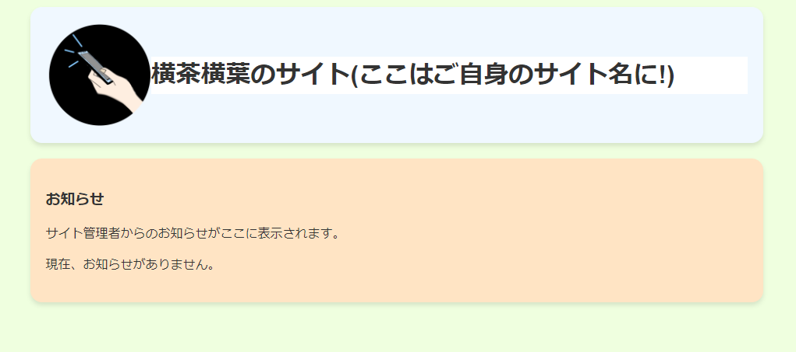
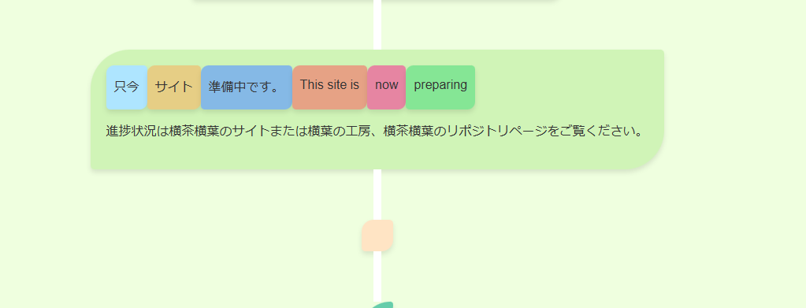

### CaffeineCSS (Rev.4) -柔らかな印象のやさしいスタイルシート    
CaffeineCSSは、商用非商用問わずどなたでも簡単に利用できる**無料のスタイルシート**です。  
サイトを**明るい色調**と**柔らかなデザイン**で彩り、**やさしい印象のサイト**を簡単に実現できます。  
個人のサイトのみならず、**子育て支援のサイト**や**福祉・介護のサイト**、**イベント系のサイト**など、エンドユーザー様に安心感・親しみを与えたいサイトの製作にもご活用いただけます。  
************************************
(このリポジトリは予告なしに削除される場合がありますので、使用時は直リンクを避け、ご自身のサーバーへアップロードすることをお勧めします。)  

<u>飽きの来ないデザインを目指したかったので、Caffeine(カフェイン 眠気覚まし)です!</u>  

ライセンスはMITライセンスまたは横茶横葉Aライセンスのいずれかからお選びいただけます。(注:このライセンスは「オープンソースライセンス」であり、価格体系に関するライセンスではございません。利用料は無料です。)  

実装方法から活用例、チートシート等を掲載いたしました。ご自由にご活用ください!  

## プロモーションと実装例  
  
CaffeineCSSは**丸角**、**stem**(茎 白い線)によるdiv要素の連結、**葉っぱ型のdiv要素デザイン**が特徴のCSSです。カラーリングもやわらかい色を採用しました。  

  
div要素内コンテンツは<u>画面サイズに応じて自動的にマージンやサイズが調整</u>され、<u>div要素に何もない場合はコンパクトな葉っぱの形に折りたたまれます。</u>  

  
**色の指定も必要ありません。** A~Zまでdivにclassを指定すれば、プリセット色で着色されます。<small>(ご自身でstyleタグを使用して色を変更することも可能です。)</small>  

  
このCSSには、テキストをあたかも画像で作られたマークのように扱えるプリセットが含まれています。通常、画像に文字を書き込んでマークとして扱うことが一般的ですが、このCSSでは文字を選択不可能にし、丸角で色付きのdiv要素内に格納することで、**画像なしでマークのような表示が可能**になります。  
<small>注: 「画像に文字を書き込んで使用するのではなく、文字をそのままスタイル付きの要素としてマークのように扱える」という意味です。</small>  

*********
### 実際の例  

1. CSS本家サイト(このCSSはこのサイトのCSSをベースに再配布可能な形へ開発されました。)  
[横茶横葉のサイト -Yokonoha!](https://yokonoha.github.io/)  
1. 横葉の工房  
[横葉の工房 -Yokonoha!](https://yokonoha.github.io/yokoha-st/)  
1. CaffeineWebApps統合サービスサイト  
[Caffeine Integrated Web Apps Suite - Integrated Service Site by Y.Yokoha Studio Projects](https://caffeineapps.pages.dev/)  

## 使い方  
このセクションでは実装方法を説明していますが、同じ内容はダウンロードページにあるBasicTemplate.htmlにも記載されています。このセクションを飛ばしてそちらをご利用いただいても問題ありません。なお、BasicTemplate.htmlにはライセンスはございませんのでご自由にご活用ください。  
**********
### はじめに (環境設定)  
CaffeineCSSなどの外部CSSファイルを適用するには、cssファイル本体を編集中のhtmlファイルと同じディレクトリへコピーした後に、以下の一文をheadタグ内に記載する必要があります。  
```Init.html
<link href="caffeine.css" rel="stylesheet"/>
```
他の外部CSSを適用する場合は順序やclass名の競合にお気を付けください。  

************* 
### タイトル表示  
最初のタイトル表示は以下のように設定します  
```titlesample.html
<div class="A"><!--この部分の"A"をA~Zまで指定することで色を変えることができます。-->
    <div class="title">
        <!--画像パスを変更して下さい。-->
        <h1>(サイト名を入力)</h1> 
    </div>
</div>
```  
プレビュー(ブラウザーやCSSリビジョンによって異なる場合があります。)    
  
*****************
### コンテンツ格納div要素のデコレーション  
コンテンツはclass指定付きのdiv要素を使用して格納します。  
classの値にはA~Zの大文字アルファベットを代入します(注1)。偶数番目と奇数番目で形が変わり、全てのアルファベットでカラーリングが異なります。  

A C E G...(奇数番目の大文字アルファベット): 全体的に丸い葉型  
B D F H...(偶数番目の大文字アルファベット): 標準的な葉型  

<small>注1: Rev.4時点では大文字アルファベット24文字分が利用できます。今後アップデートされる場合は利用可能なclass値が新規追加される場合があります。</small>
```divsample.html
<div class="C"> <!--この部分の"C"をA~Zまで指定することで色を変えることができます。-->
    <h3>新着情報</h3>
    <p>サイト管理者からのお知らせがここに表示されます。</p><!--使用例です-->
    <p>現在、お知らせがありません。</p>
</div>
```  
プレビュー(ブラウザーやCSSリビジョンによって異なる場合があります。)    
  
******************
### stem(茎 白い線)  
CaffeineCSSにおいて、stemはdiv要素同士をつなぐ白線の名称です。  
適用する際は以下のようにします。  
```stem.html
    <div class="cnt"><p></p></div>
    <div class="cnt"><p></p></div>
    <div class="cnt"><p></p></div>
    <div class="cnt"><p></p></div>
```
これはコンテンツ配置を視覚的にわかりやすく示すために使用されます。  
<u>表示崩れを避けるため、p要素には何も入力しません。</u>  
プレビュー  

******************
### マーク化  
テキストを選択不能なミニサイズのマークに変換することができます。  
テキストは各p要素へ記載します。  
以下のようにmarks-container内に配列することで正しい形で横並びに配列されます。  
class値は以下6種から選べます。  
(b:青1/b2:青2/y:黄/o:オレンジ/r:赤/g:緑)  
```marks.html
<div class="marks-container"><!--整頓専用のclass値-->
    <div class="marks-r-b2">
        <p>Marks</p>
    </div>
    <div class="marks-r-y">
        <p>decoration</p>
    </div>
    <div class="marks-r-b">
        <p>by</p>
    </div>
    <div class="marks-r-o">
        <p>utilizing</p>
    </div>
    <div class="marks-r-r">
        <p>Caffeine</p>
    </div>
    <div class="marks-r-g">
        <p>CSS!</p>
    </div>
</div>
```

******************
### フッター部分  
フッターはデフォルトで白く着色されます。  
この例にある権利表記文は、横茶横葉Aライセンスをご利用の場合、このままご利用いただければ全く問題ありません。**この通り記載することでライセンス上の権利表記要件を満たしたこととなります**。  
(MITライセンスを選択された方は、MITライセンスの一般的な表記方法に従ってください。)  
```footersample.html
<footer>
<p><small>このページでは<a href="https://github.com/Yokonoha/Caffeine_CSS" id="interchangeablecssprofiles">CaffeineCSS</a>を使用しています。</small></p>  
</footer>
```
横茶横葉Aライセンスを選択された方で、デザインの関係上この権利表記文が障害となる場合、省略を正式に可とします。  
製作者は記載漏れがあった場合、故意である場合を除き、指摘は致しませんのでご安心ください。この権利表記文を必須とした理由はスタイルシート本体に何らかの不備が見つかった場合に利用者様へ迅速にお知らせできるようにするためです。  

## ライセンスについて  
このCSSは無料でご活用いただけますが、**オープンソースライセンスまたは独自ライセンスが付加されています**。  
これらのライセンスは保証、利用条件、利用許可 などを記載したものであり、価格体系を示すものではありません。  
CaffeineCSSはMITライセンス(オープンソースライセンス)と横茶横葉Aライセンス(独自ライセンス)のマルチライセンス体系を採用しています。  
どちらにも長所と短所がございますので、利用者様の用途に合わせてお好きなものをどちらか一つお選び下さい。  

### 要点(抜粋)
- **MITライセンス** 
    - 世界的に使用されている、有名なオープンソースライセンス  
    - 様式に基づいた権利表記が必要  
    - 正式かつフォーマルな条文
- [**横茶横葉Aライセンス**](https://yokonoha.github.io/alicense)  
    - 主に横茶横葉が製作した成果物に付加される独自の互換ライセンス  
    - 条件は緩く、商用利用が可能  
    - 条文は口語(ラフな文調)での記述  
    - 権利表記は端的に記載しても問題なし
    - 見過ごせないほど良くない使い方でない限りは問題なし  
    - 条文の記載は一切不要  
    - 横茶横葉の利用規約に従う(但し、再配布は例外的に可能)  
- **共通事項**  
    - 製作者はいかなる責任も負いかねます  
    - 無償  
    - 改変可能  
    - 再配布可能  

製作者より: 色々複雑なライセンス体系となってしまい、申し訳ございません。長々と書いてしまいましたが、あまり難しく考えたくない方は横茶横葉Aライセンスを適用してご利用ください。footerの権利表記文のみで大体は条件を満たしたことになります!(できる限り記載していただきたいですが、やむを得ない場合は書かなくても指摘はしません!) 横茶横葉の独自ライセンスは初心者でもリスクなしで安心して利用できるようにするために設定されています!  

## チートシート  
このセクションと同じ内容はダウンロードページにあるBasicTemplate.htmlにも記載されています。このセクションを飛ばしてそちらをご利用いただいても問題ありません。なお、BasicTemplate.htmlにはライセンスはございませんのでご自由にご活用ください。  
**********
### HTML様式(CaffeineCSS適用済み)  
```
<!DOCTYPE html>
<html>
<head>
    <link href="caffeine.css" rel="stylesheet"/>
  <meta name="viewport" content="width=device-width,initial-scale=1">
  <title>ページタイトル</title>
  <meta charset="UTF-8">
</head>
<body>
  
</body>
</html>
```
Modified from [Blank HTML Template](https://github.com/yokonoha/blank_HTML_Template/blob/main/basic_style.html)  

### Bodyタグ部分(全て)
```all.html
  <div class="A">  
    <div class="title">  
      
    <h1>title</h1>   
     </div>  
     </div>  
     <div class="cnt"><p></p></div>
     <div class="cnt"><p></p></div>
     <div class="cnt"><p></p></div>
     <div class="cnt"><p></p></div>
     <div class="B"> 
<!--マーク化テンプレート/Marks template-->

<!--div B Start-->
<div class="marks-container"><!--横並び用(align vertically)-->
    <div class="marks-r-b2">
        <p>Marks</p>
    </div>
    <div class="marks-r-y">
        <p>decoration</p>
    </div>
    <div class="marks-r-b">
        <p>by</p>
    </div>
    <div class="marks-r-o">
        <p>utilizing</p>
    </div>
    <div class="marks-r-r">
        <p>Caffeine</p>
    </div>
    <div class="marks-r-g">
        <p>CSS!</p>
    </div>
</div>

<!--div B End-->
    </div> 
    
    <div class="cnt"><p></p></div>
    <div class="cnt"><p></p></div>
    <div class="cnt"><p></p></div>
    <div class="cnt"><p></p></div>
    
    <div class="C">  
<!-- ここに要素を挿入-->

    </div>  
    
    <div class="cnt"><p></p></div>
    <div class="cnt"><p></p></div>
    <div class="cnt"><p></p></div>
    <div class="cnt"><p></p></div>
    
    <div class="D">  
<!-- ここに要素を挿入-->

    </div>  
    
    <div class="cnt"><p></p></div>
    <div class="cnt"><p></p></div>
    <div class="cnt"><p></p></div>
    <div class="cnt"><p></p></div>
    
    <div class="E">  
<!-- ここに要素を挿入-->

    </div>  
    
    <div class="cnt"><p></p></div>
    <div class="cnt"><p></p></div>
    <div class="cnt"><p></p></div>
    <div class="cnt"><p></p></div>
    
    <div class="F">  
<!-- ここに要素を挿入-->

    </div>  
    
    <div class="cnt"><p></p></div>
    <div class="cnt"><p></p></div>
    <div class="cnt"><p></p></div>
    <div class="cnt"><p></p></div>
    
    <div class="G">  
<!-- ここに要素を挿入-->

    </div>  
    
    <div class="cnt"><p></p></div>
    <div class="cnt"><p></p></div>
    <div class="cnt"><p></p></div>
    <div class="cnt"><p></p></div>
    
    <div class="H">  
<!-- ここに要素を挿入-->

    </div>
    <div class="cnt"><p></p></div>
    <div class="cnt"><p></p></div>
    <div class="cnt"><p></p></div>
    <div class="cnt"><p></p></div>
    <div class="I">  
        <!-- ここに要素を挿入-->
        
     </div>
     <div class="cnt"><p></p></div>
     <div class="cnt"><p></p></div>
     <div class="cnt"><p></p></div>
     <div class="cnt"><p></p></div>
     <div class="J">  
                <!-- ここに要素を挿入-->
                
     </div>
    <div class="cnt"><p></p></div>
    <div class="cnt"><p></p></div>
    <div class="cnt"><p></p></div>
    <div class="cnt"><p></p></div>
    <div class="K">  
     <!-- ここに要素を挿入-->
                        
     </div>
     <div class="cnt"><p></p></div>
     <div class="cnt"><p></p></div>
     <div class="cnt"><p></p></div>
     <div class="cnt"><p></p></div>
     <div class="L">  
      <!-- ここに要素を挿入-->
                         
      </div>

    <div class="cnt"><p></p></div>
    <div class="cnt"><p></p></div>
    <div class="cnt"><p></p></div>
    <div class="cnt"><p></p></div>
    <div class="M">  
    <!-- ここに要素を挿入-->

    </div>
    <div class="cnt"><p></p></div>
    <div class="cnt"><p></p></div>
    <div class="cnt"><p></p></div>
    <div class="cnt"><p></p></div>
    <div class="N">  
    <!-- ここに要素を挿入-->

    </div>
    <div class="cnt"><p></p></div>
    <div class="cnt"><p></p></div>
    <div class="cnt"><p></p></div>
    <div class="cnt"><p></p></div>
    <div class="O">  
    <!-- ここに要素を挿入-->

    </div>
    <div class="cnt"><p></p></div>
    <div class="cnt"><p></p></div>
    <div class="cnt"><p></p></div>
    <div class="cnt"><p></p></div>
    <div class="P">  
    <!-- ここに要素を挿入-->

    </div>
    <div class="cnt"><p></p></div>
    <div class="cnt"><p></p></div>
    <div class="cnt"><p></p></div>
    <div class="cnt"><p></p></div>
    <div class="Q">  
    <!-- ここに要素を挿入-->

    </div>
    <div class="cnt"><p></p></div>
    <div class="cnt"><p></p></div>
    <div class="cnt"><p></p></div>
    <div class="cnt"><p></p></div>
    <div class="R">  
    <!-- ここに要素を挿入-->

    </div>
    <div class="cnt"><p></p></div>
    <div class="cnt"><p></p></div>
    <div class="cnt"><p></p></div>
    <div class="cnt"><p></p></div>
    <div class="S">  
    <!-- ここに要素を挿入-->

    </div>
    <div class="cnt"><p></p></div>
    <div class="cnt"><p></p></div>
    <div class="cnt"><p></p></div>
    <div class="cnt"><p></p></div>
    <div class="T">  
    <!-- ここに要素を挿入-->

    </div>
    <div class="cnt"><p></p></div>
    <div class="cnt"><p></p></div>
    <div class="cnt"><p></p></div>
    <div class="cnt"><p></p></div>
    <div class="U">  
    <!-- ここに要素を挿入-->

    </div>
    <div class="cnt"><p></p></div>
    <div class="cnt"><p></p></div>
    <div class="cnt"><p></p></div>
    <div class="cnt"><p></p></div>
    <div class="V">  
    <!-- ここに要素を挿入-->

    </div>
    <div class="cnt"><p></p></div>
    <div class="cnt"><p></p></div>
    <div class="cnt"><p></p></div>
    <div class="cnt"><p></p></div>
    <div class="W">  
    <!-- ここに要素を挿入-->

    </div>
    <div class="cnt"><p></p></div>
    <div class="cnt"><p></p></div>
    <div class="cnt"><p></p></div>
    <div class="cnt"><p></p></div>
    <div class="X">  
    <!-- ここに要素を挿入-->

    </div>
    <div class="cnt"><p></p></div>
    <div class="cnt"><p></p></div>
    <div class="cnt"><p></p></div>
    <div class="cnt"><p></p></div>
    <div class="Y">  
    <!-- ここに要素を挿入-->

    </div>
    <div class="cnt"><p></p></div>
    <div class="cnt"><p></p></div>
    <div class="cnt"><p></p></div>
    <div class="cnt"><p></p></div>
    <div class="Z">  
    <!-- ここに要素を挿入-->

    </div>
        <footer>

      <p><small>このページでは<a href="https://github.com/yokonoha/Caffeine_CSS"　id="interchangeablecssprofiles">CaffeineCSS</a>を使用しています。</small></p>  
    </footer>
```
CaffeineCSS & Documentations made by Y.Yokoha.  
©2024-2025 横茶横葉 All Rights Reserved.  
©2024-2025 横葉の工房 All Rights Reserved.  

