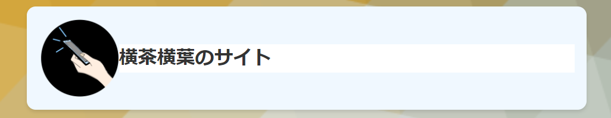

# Caffeine_CSS 
 
# 現在ドキュメンテーション編集中です!更新までお待ち下さい！/The brand new documentation is now editing.Please wait!  

  
English translation(By machine translator) is available below!  
どなたでも気軽に利用(流用)できる横茶横葉のサイトのスタイルシートです!  
色分けが簡単に行えるためサイトに彩りを添えることができます。  
実装するのにさほど時間がかからず楽してサイトを綺麗に整頓できる(多分)のがいい点です!  
(このリポジトリは予告なしに消滅することがありますので、使用時は直リンクを避け、ご自身のサーバーへアップロードすることをお勧めします。)  
飽きの来ないデザインを目指したかったので、Caffeine(カフェイン 眠気覚まし)です!  
名称変更の理由は、ブラウザーと混同しないようにするためです!  

このスタイルシートにはほとんど制約がなく、自由度の高い横茶横葉AライセンスまたはMITライセンスが適用されます。  
https://yokochayokoha.github.io/alicense  
 (この成果物に関してはMITライセンス、横茶横葉のAライセンスのどちらかお好きな方をお選びいただけます。)  
実装方法から活用例、チートシートまで下にいろいろ書いておきましたのでご自由にご活用ください!  
### 大切なお知らせ  
色々変更を加えすぎたので、この指示通りに使ってもうまくいかない可能性があります。その場合はドキュメンテーションの更新をお待ちいただくか、各リリースページ付属のBasicTemplateを御利用下さい!(時間があればいつか書き足します...)  
## 使い方　　
最初のタイトル表示は以下のように設定します(もちろんコピペしてOK!)  
```html:title.html
        <div class="A">
            <div class="title">
                 <!--ここのimg srcは変えてくださいね!-->
                 <h1>横茶横葉のサイト(ここはご自身のサイト名に!)</h1> 
            </div>
       </div>
```
その下からは、div class=B~Hまで用意しています。(Rev.1時点で)  
以下のように  
```html:contents.html
        <div class="C"> <!--この部分の"C"をB~Hまで指定することで色を変えることができます。-->
<h3>お知らせ</h3>
<p>サイト管理者からのお知らせがここに表示されます。</p><!--使用例です-->
<p>現在、お知らせがありません。</p>
</div>
```
すれば、CSSが適用できます。  
実装例  
  
横茶横葉のサイトでは一部改変されていますが、フルに使っています。  
活用例1:https://yokochayokoha.github.io  
あんずはあんずが食べたい! ページでは画像やテキストなどを挟みながら使用しています。  
活用例2:https://yokochayokoha.github.io/anzu  
上記サイトは全部htmlに埋め込んで使用していますが、チートシート(早見表のことです。下記記載)を使えば、簡単に実装できます。
## チートシート  
楽がしたい方のためにチートシートをご用意しました。コピペして御利用下さい!(一部未検証。間違いあるかも..)  

### 1.CSS適用(ご自身のサーバーにアップしてから貼り付けます。ルートディレクトリに配置!)  
Rev.1版  
```
<link href="caffeine.css" rel="stylesheet"/>
```

### 2.タイトル表示  
```
<div class="A">  
<div class="title">  
  
<h1></h1>   
 </div>  
 </div>  
```
### 3.B~Hまでのdiv(Rev3からMまで利用可)  
```
<div class="B">  
</div> 

<br>

<div class="C">  
</div>  

<br>

<div class="D">  
</div>  

<br>

<div class="E">  
</div>  

<br>

<div class="F">  
</div>  

<br>

<div class="G">  
</div>  

<br>

<div class="H">  
</div>
```
### 補足  
Rev3.0で大幅すぎる改変を行っているので、更なる説明書きが必要になってしまいました。  
そのため、ドキュメントの追加をお待ちください。または、各リリースページ付属のBasic_Templateをご活用ください。  
#### おまけ (これ、smallタグでOKなのでどこかに書いてくれると、誰か(CSSで楽したい方)の助けになるかもしれないのでとっても嬉しいです! もちろん、書かなくても"全然OK"です! あ、「全然」の誤用法、誰かに直されそう....)  
```
<p><small>このページでは<a href="https://github.com/YokochaYokoha/Caffeine_CSS">Caffeine_CSS</a>を使用しています。</small></p>  
```  

### 今後の展望ともう一つ  
このCSSは個人的に楽するために作ったものですが、気が向いたら改善版や拡張版(色を増やす 等)、div大幅追加版(サブタイトル対応とか)をつくろうかなぁ って考えています!  
あと、HTMLも枠組み書くのが面倒だったので軽いフレームワーク的なものをあげておきました。併せてご利用くださいね!  
https://github.com/YokochaYokoha/blank_HTML_Template  
2024/10/08追記:  
全部入りのHTMLテンプレートもご用意しました!  
徹底的に時短と楽がしたい! Time is like a precious thing, maybe!  
横茶横葉Aライセンス適用範囲内でご自由にお使いくださいっ!!!!  
©2024 横葉スタジオプロジェクト All Rights Reserved.  

---
### English translation(By machine translator So, this may be a little bit strange.　Pls refer to the original Japanese description if you can.)  

# Caffeine_CSS  
  
This is a stylesheet for my website that anyone can freely use (or modify)!  
The good point is that you can easily add color to your website without much effort and quickly organize your site beautifully (probably)!  
(Please note that this repository may disappear without notice, so I recommend uploading it to your server instead of directly linking to it when using it.)  


This stylesheet is subject to the Y.Yokoha A License or MIT License, which imposes almost no restrictions and offers high freedom.  
https://yokochayokoha.github.io/alicense  
This product is multi licensed. You can choose which license you want to apply.  
I've written down various instructions, usage examples, and a cheat sheet below, so feel free to make use of them!
## IMPORTANT NOTICE  
I have made too significant changes in Rev 3.0 and further explanatory notes are required.   
Therefore, please wait for additional documentation. Alternatively, please use the Basic_Template provided with each release page.  
## How to Use  
The initial title display is set as follows (of course, feel free to copy and paste!):  
```html:title.html
        <div class="A">
            <div class="title">
                 <!-- Replace this img src with your own!-->
                 <h1>Yokochayokoha's Website (replace this with your own site name!)</h1> 
            </div>
       </div>
```
After that, div classes from B to H are available (as of Rev.1).  
For example,  
```html:contents.html
        <div class="C"> <!-- You can change the color by specifying B to H here in place of "C". -->
<h3>Notice</h3>
<p>Site admin notices will be displayed here.</p><!-- Example usage -->
<p>Currently, there are no notices.</p>
</div>
```
and the CSS will be applied.  
Example implementation:  
  
The site for Yokochayokoha uses this fully, although with some modifications.  
Example 1: https://yokochayokoha.github.io  
The "Anzu Wants to Eat Apricots!" page uses it while inserting images and text.  
Example 2: https://yokochayokoha.github.io/anzu  
The above sites embed everything directly into HTML, but you can easily implement it using the cheat sheet (quick reference sheet) below.

## Cheat Sheet  
For those who want to save time, here's a cheat sheet for your convenience. Feel free to copy and use it! (Some parts are unverified. There might be mistakes...)

### 1. Applying CSS (Upload it to your server first, then paste it. Place it in the root directory!)  
Rev.1 version:  
```
<link href="caffeine.css" rel="stylesheet"/>
```

### 2. Title Display  
```
<div class="A">  
<div class="title">  
  
<h1></h1>   
 </div>  
 </div>  
```

### 3. Divs from B to H  
```
<div class="B">  
</div> 

<br>

<div class="C">  
</div>  

<br>

<div class="D">  
</div>  

<br>

<div class="E">  
</div>  

<br>

<div class="F">  
</div>  

<br>

<div class="G">  
</div>  

<br>

<div class="H">  
</div>
```

#### Bonus (It’s just a small tag, so writing it somewhere might help someone who wants to save time with CSS! Of course, it’s okay if you don’t write it!  
```
<p><small>This page uses <a href="https://github.com/YokochaYokoha/Caffeine_CSS">Caffeine_CSS</a>.</small></p>  
```

### Future Plans and One More Thing  
This CSS was made for personal convenience, but if I feel like it, I might release improved or extended versions (such as adding more colors, adding more divs, supporting subtitles, etc.)!  
Additionally, since I found writing the HTML structure tedious, I’ve shared a lightweight framework-like template. Feel free to use it as well!  
https://github.com/YokochaYokoha/blank_HTML_Template  
I want to save as much time and effort as possible! Time is like a precious thing, maybe! 
©2024 Yokoha Studio All Rights Reserved.  
Made by Y.Yokoha  
